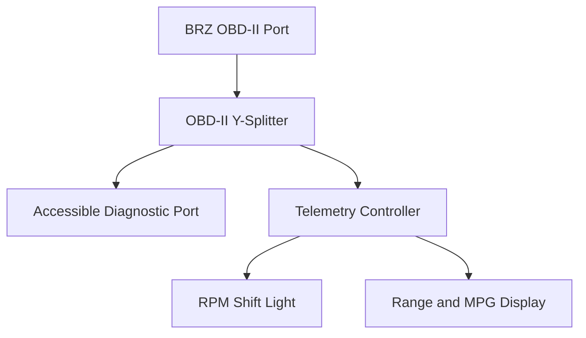

# System Architecture

## Overview

The proposed BRZ telemetry system consists of a central controller that drives two physically separate display modules.

## Telemetry Controller

The central controller will:

- Passively receive broadcast CAN frames
- Decode engine RPM, speed, throttle, and other available signals
- Send limited diagnostic requests when necessary
- Calculate average MPG and estimated range
- Drive both display modules
- Yield diagnostic polling when an external scan tool is connected
- Enter a low-power state when the vehicle is off

The development prototype will use an Adafruit Feather M4 CAN Express. A custom automotive controller PCB is planned for the final revision.

## Shift-Light Module

The shift-light module will be mounted on/under the instrument-cluster hood.

It will:

- Receive low-latency RPM information
- Progressively illuminate approximately 12 to 15 LEDs
- Flash at the configured shift threshold
- Adjust brightness automatically
- Turn off if RPM information becomes invalid or stale

## Fuel-Display Module

The second module will continuously show:

- Estimated remaining range
- Average MPG since the most recent refueling event

It will be mounted separately from the shift light, likely on the dash near the center A/C vents.

## Vehicle Interface

The initial prototype will access CAN through OBD-II pins 6 and 14. The Y-splitter preserves a second connector for external diagnostic equipment.

The final installation may use a hidden dashboard CAN connection if testing confirms that it provides the same required data.

## Unverified Assumptions

The following items must be tested on the specific vehicle:

- Engine RPM is available in broadcast CAN frame `0x140`
- Fuel level is available through OBD-II or broadcast CAN
- Mass airflow and vehicle speed update quickly enough for MPG estimation
- Automatic-transmission mode or selected gear can be decoded
- An external diagnostic tool can coexist with the controller in passive mode
